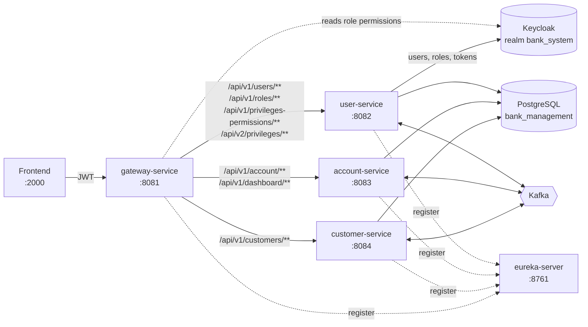

# Java-POC – Banking Microservices: Documentation

A proof-of-concept banking back office built as Spring Boot microservices. Admin users manage **customers**, their **bank accounts**, and the **users / roles / permissions** that control who can do what. Creating a customer automatically creates a login user and a savings account through a Kafka-based saga.

## Contents

| Document | What it covers |
|---|---|
| [Getting started](getting-started.md) | Prerequisites, building, running locally, first-time setup |
| **Services** | |
| [Gateway service](services/gateway-service.md) | Routing, JWT validation, the permission filter |
| [User service](services/user-service.md) | Login, users, roles, privileges, endpoints, permissions (all APIs) |
| [Customer service](services/customer-service.md) | Customers, locations, the customer-creation saga (all APIs) |
| [Account service](services/account-service.md) | Accounts, currencies, dashboard (all APIs) |
| [Eureka server](services/eureka-server.md) | Service registry |
| [Config server](services/config-server.md) | Central configuration server |
| [common-lib](services/common-lib.md) | Shared Kafka event classes and the audit logger |
| **Cross-cutting** | |
| [Kafka events & saga](kafka-events-and-saga.md) | Every topic, producer, consumer, and the create/rollback flows |
| [Security & Keycloak](security-keycloak.md) | Authentication, authorization, Keycloak setup |
| [Logging & monitoring](logging-monitoring.md) | Audit logs, ELK, Prometheus, Grafana |
| **Deployment** | |
| [Docker](docker.md) | Dockerfiles and the three docker-compose files |
| [Kubernetes](kubernetes.md) | The `k8s/` manifests, deploy steps, ports |
| [CI/CD](ci-cd.md) | The GitLab pipeline |
| [Known issues](known-issues.md) | Bugs and gaps found during the code review, with fixes |

## Architecture



**Key points**

- **The gateway is the only public entry point.** It validates the Keycloak JWT, checks the caller's role permissions, then forwards the request with `X-Gateway-Auth: trusted` and `X-User-*` headers. The services reject requests without that header (except a few public login endpoints).
- **Services call each other through the gateway**, forwarding the caller's token (`service.url` / `main.service.url` / `user.service.url`). There are no direct service-to-service HTTP calls.
- **One database, three schemas.** `user_schema`, `customer_schema` and `account_schema` live in the same PostgreSQL database (`bank_management`).
- **Kafka connects the create/update/delete flows.** Customer creation is a saga across all three services, with compensating rollback events. See [Kafka events & saga](kafka-events-and-saga.md).
- **Eureka** is used for registration. The gateway routes to fixed URLs (`USER_SERVICE`, `ACCOUNT_SERVICE`, …), not `lb://` discovery.

## Services at a glance

| Service | Port | Base path(s) | Database schema | Main responsibility |
|---|---|---|---|---|
| gateway-service | 8081 | all `/api/**` | – | Routing, JWT, permission checks |
| user-service | 8082 | `/api/v1/users`, `/api/v1/roles`, `/api/v1/privileges-permissions`, `/api/v2/privileges` | `user_schema` | Login, users, roles, RBAC |
| account-service | 8083 | `/api/v1/account`, `/api/v1/dashboard` | `account_schema` | Bank accounts, dashboard |
| customer-service | 8084 | `/api/v1/customers` | `customer_schema` | Customers, locations, saga orchestration |
| eureka-server | 8761 | `/` (dashboard) | – | Service registry |
| configserver | 8888 | `/{app}/{profile}` | – | Central config (not consumed yet) |
| common-lib | – | – | – | Shared library (jar), not a running service |

## Tech stack

| Area | Technology |
|---|---|
| Language / build | Java 17, Maven (wrapper per module), Lombok |
| Framework | Spring Boot 3, Spring Web, Spring WebFlux (gateway), Spring Data JPA / Hibernate, Bean Validation |
| Spring Cloud | Gateway, Netflix Eureka, Config Server, OpenFeign |
| Resilience | Resilience4j (circuit breaker, retry, time limiter), Spring Retry |
| Security | Keycloak 26, Spring Security OAuth2 Resource Server (JWT), auth0 java-jwt, AES (reset links) |
| Messaging | Apache Kafka (KRaft, Confluent 7.5), Spring Kafka, dead-letter topics |
| Database | PostgreSQL 15, Flyway |
| Email | Spring Mail (Gmail SMTP), Thymeleaf templates |
| Observability | Spring Boot Actuator, Micrometer + Prometheus, Grafana, Logback + logstash-logback-encoder, ELK 8.15 |
| Delivery | Docker (multi-stage), Docker Compose, Kubernetes, GitLab CI (+ SAST / SpotBugs) |

## API conventions (all services)

**Base URL:** always call the gateway: `http://<gateway-host>:8081` (Kubernetes: `http://localhost:30881`).

**Authentication:** send the access token from `POST /api/v1/users/login`:

```
Authorization: Bearer <accessToken>
```

**Response envelope.** Every JSON endpoint returns the same wrapper (`ApiResponse<T>`); `null` fields are omitted:

```json
{
  "status": "success",        // "success" | "error"
  "message": "Human readable message",
  "data": { },                // endpoint-specific payload
  "count": 12                 // only on count endpoints
}
```

**Paginated payloads** share this shape (the list field name varies: `data`, `account`, or `customers`):

```json
{ "data": [ ], "currentPage": 0, "totalPages": 5, "totalItems": 48, "pageSize": 10 }
```

**Pagination query parameters** (where supported): `page` (0-based, default `0`), `size` (default `10`), `sortField`, `sortDirection` (`ASC` / `DESC`).

**Errors.** Services return `{"status":"error","message":"..."}` with an HTTP status from their exception handler. Note that user-service returns **302** for several business errors; see [Known issues](known-issues.md#6-user-service-returns-302-for-business-errors).

| Status | Typical cause |
|---|---|
| 400 | Validation failed (`@Valid`), bad UUID / enum in path or query |
| 401 | Missing / expired token (gateway): `{"status":"error","message":"Invalid or expired token"}` |
| 404 | Entity not found |
| 500 | Unexpected error, failed create/update/delete. **Also returned by the gateway when your role lacks permission for the endpoint** (see [Known issues](known-issues.md#7-permission-denied-returns-500-instead-of-403)) |
| 503 | Circuit breaker open |

**CORS.** The gateway allows the origins listed in `CORS_ALLOWED_ORIGINS` (default: `http://localhost:5173`, `http://localhost:2000`, `http://10.1.0.47:5173`, `http://10.1.0.47:2000`). Add your frontend origin there.
