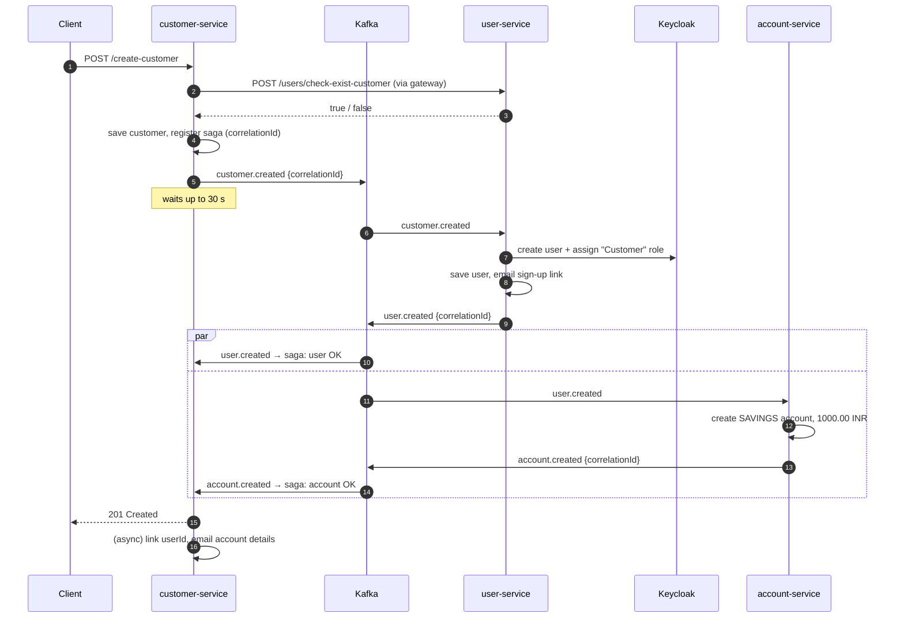
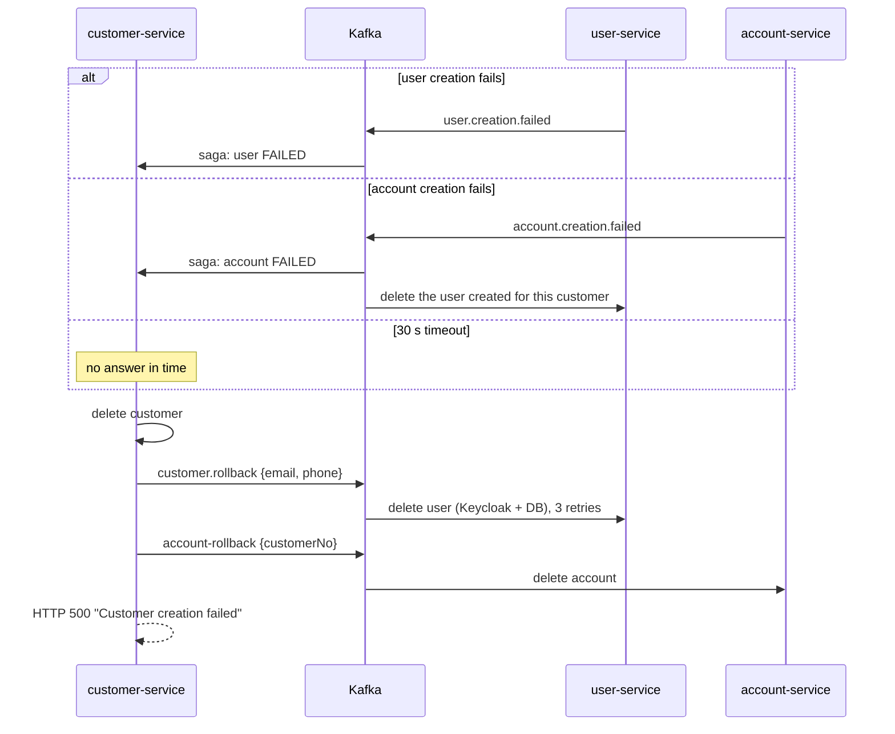

# Kafka events & the customer saga

Kafka links the three business services for everything that spans more than one of them: creating, updating and deleting a customer. Broker: `kafka:9092`, single node, KRaft mode.

## Topic catalogue

| Topic | Producer | Consumers (group) | Payload class |
|---|---|---|---|
| `customer.created` | customer-service | user-service (`user-service-group`) | `CustomerCreatedEvent` |
| `user.created` | user-service | account-service (`account-service-group`), customer-service (`customer-service-group`), customer-service saga (`customer-service-saga-group`) | `UserCreatedEvent` |
| `user.creation.failed` | user-service | customer-service saga | `UserCreationFailedEvent` |
| `account.created` | account-service | customer-service saga | `AccountCreatedEvent` |
| `account.creation.failed` | account-service | customer-service saga, user-service (`user-service-compensation`) | `AccountCreationFailedEvent` |
| `customer.updated` | customer-service | user-service | `CustomerUpdatedEvent` |
| `customer.deleted` | customer-service | user-service, account-service | `CustomerDeletedEvent` |
| `customer.rollback` | customer-service | user-service (`user-service-rollback-group`) | `UserRollbackEvent` (also `CustomerRollbackEvent`) |
| `account-rollback` | customer-service | account-service | `AccountRollbackEvent` |
| `<topic>.DLT` | account-service error handler | – | failed messages after 3 retries |

All payloads are JSON (`JsonSerializer` / `JsonDeserializer`, trusted packages `*`). Class definitions: [common-lib](services/common-lib.md).

> Naming: every topic uses dots except `account-rollback` (hyphen). Keep it as-is unless you change both the producer and the consumer.

## Customer creation saga

`POST /api/v1/customers/create-customer` is an **orchestrated saga with a synchronous wait**: the HTTP request stays open until the downstream services report back.



**Success condition:** both `user.created` and `account.created` arrive for the same `correlationId` within 30 seconds.

### Failure and rollback



### Idempotency

- user-service and account-service record processed `eventId`s in a `consumed_events` table and skip duplicates for `customer.created` and `user.created`.
- Update, delete and rollback consumers have **no** duplicate check. They are mostly safe because they delete or overwrite, but a redelivered update applies twice.

### Where saga state lives

`CustomerCreationSagaTracker` keeps pending sagas in memory (`ConcurrentHashMap` + `CompletableFuture`). user-service similarly keeps a customerNo → email map in memory (`UserRollbackConsumer`). This means:

- A customer-service restart during a saga loses it. The client gets an error, but the user and account may already have been created.
- With **more than one replica**, the `*.created` events may be consumed by a different pod than the one waiting. The waiting pod then times out and rolls back a customer that actually succeeded. **Run customer-service and user-service with 1 replica** until saga state moves to the database or Redis.

## Update flow

`PUT /api/v1/customers/{customerNo}` → `customer.updated` → user-service finds the user **by email** and updates name, address, date of birth and status. Changing a customer's email therefore breaks the link, because the lookup uses the new email.

## Delete flow

`DELETE /api/v1/customers/delete-customer-by-id/{id}`:
1. customer-service checks the account is `CLOSED` with balance 0 (via account-service).
2. Publishes `customer.deleted`, then deletes the customer.
3. user-service deletes the linked user (Keycloak + DB); account-service deletes the account.

## Error handling

- **account-service:** `DefaultErrorHandler` retries a failed record 3 times, 5 s apart, then publishes it to `<topic>.DLT`.
- **user-service rollback:** `@Retryable` 3 attempts (2 s, ×2 backoff), then logs the failure (`@Recover`).
- Other consumers catch and log errors, so the message is not retried.

## Consumer settings (all services)

`listener.type: batch`, `ack-mode: manual`, `concurrency: 3`, `max.poll.records: 500`, `auto-offset-reset: earliest`. Producers: `acks=all`, idempotence on, 3 retries, snappy compression.

## Inspecting topics

- **Kafka UI:** `http://localhost:8585` (Docker) or `http://localhost:30885` (Kubernetes).
- **CLI:**
  ```bash
  kubectl exec deploy/kafka -- kafka-topics --bootstrap-server localhost:9092 --list
  kubectl exec deploy/kafka -- kafka-console-consumer --bootstrap-server localhost:9092 --topic customer.created --from-beginning
  ```
