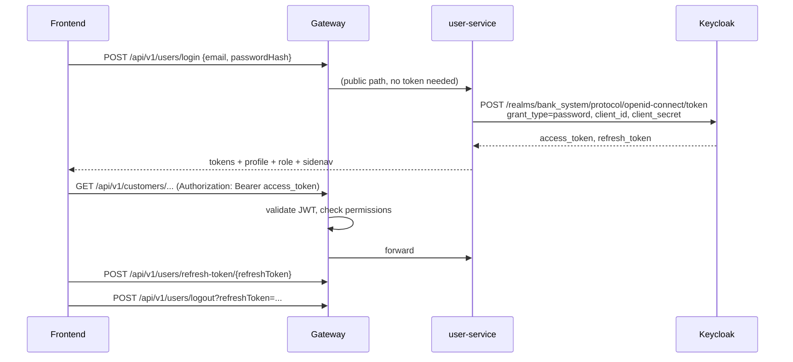

# Security & Keycloak

## Overview

| Layer | Mechanism |
|---|---|
| Identity | **Keycloak 26**, realm `bank_system`, confidential client `poc-api-gateway` |
| Login | user-service exchanges email + password for tokens (OAuth2 *password* grant) |
| Authentication | gateway validates the JWT (Spring Security OAuth2 Resource Server) |
| Authorization | gateway `PermissionFilter` checks the role's `permissions` attribute in Keycloak |
| Service trust | backends accept only requests with `X-Gateway-Auth: trusted` |
| Audit | `AuditLogger` → `audit.log` (JSON) in every service |

## Login and token lifecycle



## How permissions work

1. An admin defines **privileges** (menu modules) and **endpoints** (`backendUrl` + `httpMethod`) in user-service.
2. user-service creates a **permission row** for every role × endpoint (`permissionType` YES/NO, `sideNav` YES/NO).
3. On every permission change, user-service writes the role's permissions to the Keycloak role attribute `permissions` (a list of JSON strings):
   ```json
   {"backendUrl":"/api/v1/customers/create-customer","httpMethod":"post","permissionType":"YES","endpointName":"Create customer", ...}
   ```
4. For each request, the gateway reads the caller's realm roles from the JWT (`realm_access.roles`), loads each role's `permissions` attribute from Keycloak, and allows the request if **any** entry has:
   - `backendUrl` contained in the request path (case-insensitive), and
   - `httpMethod` equal to the request method (case-insensitive), and
   - `permissionType` = `YES`.
5. Roles named **`Admin`** or **`Asst Manager 1`** bypass the check entirely.

### Role hierarchy

Roles have a dotted `position`: `1` (Admin), `1.1`, `1.2`, `2`, `2.1`, …

- A new role goes under its creator (`1.x`) or at a chosen position (`hierarchy`), and existing roles shift.
- A new role starts with its parent's permission rows, all set to `NO` (all `YES` for position `1`).
- Users can only see and assign roles **below** them (`filter-roles`, `dropdown-list`), and can only edit permissions they hold themselves.
- `roleCreate = YES` lets a role's users create roles.

## First-time Keycloak setup

Do this once per environment (the realm isn't imported automatically).

1. Open the Keycloak admin console: `http://localhost:8182` (Docker) or `http://localhost:30081` (Kubernetes). Log in with the bootstrap admin (`KEYCLOAK_ADMIN_USERNAME` / `KEYCLOAK_ADMIN_PASSWORD`).
2. **Create the realm** `bank_system`.
3. **Create the client** `poc-api-gateway` in that realm:
   - Client authentication: **On** (confidential)
   - Authentication flow: tick **Direct access grants** (needed for the password grant used by login)
   - Save, then copy the secret from the **Credentials** tab → `KEYCLOAK_CLIENT_SECRET`.
4. The services use the **master** realm admin (`KEYCLOAK_ADMIN_USERNAME` / `_PASSWORD`, realm `master`) to manage users and roles in `bank_system`. The bootstrap admin works; for anything beyond local dev, create a dedicated admin user.
5. Start the services, then bootstrap the application admin:
   ```bash
   curl -X POST http://localhost:8081/api/v1/users/create-admin
   ```
   This creates the `Admin` realm role and the user `admin@gmail.com` with the password from `ADMIN_INITIAL_PASSWORD`. **Log in and change this password immediately** (`PUT /api/v1/users/update-new-password/{id}`).
6. Log in as admin and create a role named exactly **`Customer`** (`POST /api/v1/roles/add`). The customer saga looks this role up by name. Without it, customer creation fails with `CUSTOMER role not found`.
7. Create privileges and endpoints for each API you want non-admin roles to use, then grant them per role (`PUT /api/v2/privileges/permission/save-roles/{roleId}`).

> Tip: once configured, export the realm (Realm settings → Action → Partial export) and commit the JSON **without secrets**, so new environments can import it with `start-dev --import-realm`.

## Security findings (to fix)

| # | Issue | Risk | Fix |
|---|---|---|---|
| 1 | Secrets committed in git: DB password, Keycloak client secret, SMTP app password, AES key (`docker-compose*.yml`, old `k8s1/`, `.env`), GitLab token (configserver) | Anyone with repo access has production credentials | **Rotate all of them.** Use `.env` (untracked) for compose and `k8s/00-config/secrets.yaml` (gitignored) for K8s. Remove `.env` from git: `git rm --cached .env`. |
| 2 | Backends trust the `X-Gateway-Auth: trusted` header without verifying the JWT | If a backend port is reachable, anyone can forge the header and skip all checks | Keep backends private (K8s: ClusterIP, done). Better: validate the JWT in each service too (`oauth2ResourceServer().jwt()`). |
| 3 | `POST /api/v1/users/create-admin` is public | Fine once used; on a fresh DB anyone can create the admin (password now comes from `ADMIN_INITIAL_PASSWORD` ✅) | Disable after bootstrap or protect with a setup token. |
| 4 | Admin bypass by hardcoded role names (`Admin`, `Asst Manager 1`) | Renaming/creating roles with these names changes security | Use a role attribute or `position = 1`. |
| 5 | Permission match is a substring (`path.contains(backendUrl)`) | A short `backendUrl` grants many endpoints | Match on exact path patterns (`AntPathMatcher`). |
| 6 | Permission denied returns HTTP 500 | Clients can't tell auth failures from server errors | Return 403 from `PermissionFilter`. |
| 7 | Keycloak queried per role on every request | Latency and Keycloak load | Cache role permissions (e.g. Caffeine, 1–5 min TTL). |
| 8 | Password grant (ROPC) for login | Deprecated in OAuth 2.1; no MFA/SSO | Move the frontend to Authorization Code + PKCE when feasible. |
| 9 | SQL bind-parameter logging at TRACE | Personal data written to logs | Set `org.hibernate.orm.jdbc.bind` to `INFO` outside local dev. |
