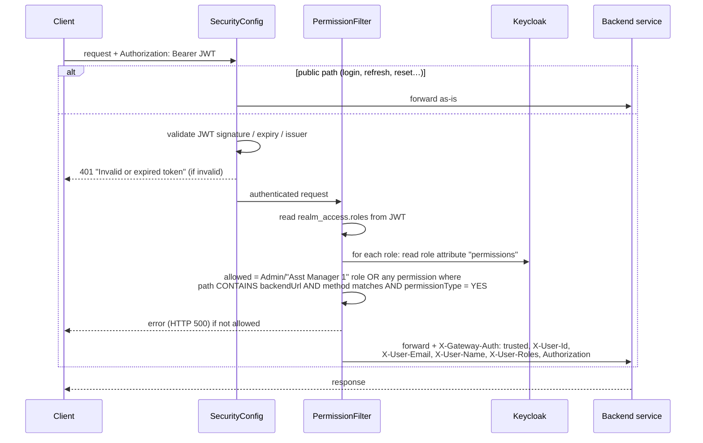

# gateway-service

| | |
|---|---|
| **Port** | 8081, the only port clients should call |
| **Source** | [`gateway-service/`](../../gateway-service) |
| **Stack** | Spring Cloud Gateway (reactive / WebFlux), Spring Security OAuth2 Resource Server, Keycloak admin client |
| **Has its own APIs?** | No business APIs; routing plus actuator only |

## What it does

Every request passes through three steps:

1. **Authentication (`SecurityConfig`).** Validates the Keycloak JWT against `SPRING_SECURITY_OAUTH2_RESOURCESERVER_JWT_ISSUER_URI`. Unauthenticated → `401 {"status":"error","message":"Invalid or expired token"}`. Every failure is written to the audit log.
2. **Authorization (`PermissionFilter`).** Loads each of the user's realm roles from Keycloak and reads its `permissions` attribute: a list of JSON objects `{backendUrl, httpMethod, permissionType, endpointName, …}` that user-service keeps in sync. Roles named `Admin` or `Asst Manager 1` skip the check.
3. **Routing (`GatewayRoutesConfig`).** Forwards to the backend, adding identity headers. Backends only accept requests that carry `X-Gateway-Auth: trusted`.

## Routes

| Route id | Paths | Target (env var) |
|---|---|---|
| `user-service` | `/api/v1/users/**`, `/api/v1/roles/**`, `/api/v1/privileges-permissions/**`, `/api/v2/privileges/**` | `USER_SERVICE` |
| `account-service` | `/api/v1/account/**`, `/api/v1/dashboard/**` | `ACCOUNT_SERVICE` |
| `customer-service` | `/api/v1/customers/**` | `CUSTOMER_SERVICE` |
| `monitoring` | `/actuator/gateway/**` | `GATEWAY_SERVICE` |

Targets are fixed URLs (for example `http://user-service:8082`), not Eureka `lb://` lookups.

## Public paths (no token)

Both `SecurityConfig` and `PermissionFilter` let these through:

`/api/v1/users/login`, `/api/v1/users/refresh-token/**`, `/api/v1/users/reset-password`, `/api/v1/users/get-by-id-encrypted/**`, `/api/v1/users/forgot-password-mail-send`, `/api/v1/users/register-new`, `/api/v1/users/create-admin`, `/actuator/health`, `/actuator/info`, and all `OPTIONS` (CORS preflight) requests.

`/api/v1/users/logout` needs a valid token but skips the permission check.

## Headers added for backends

| Header | Value |
|---|---|
| `X-Gateway-Auth` | `trusted`. Backends reject requests without it. |
| `Authorization` | the original `Bearer` token (forwarded so services can call each other) |
| `X-User-Id` | JWT `sub` |
| `X-User-Email` | JWT `email` |
| `X-User-Name` | JWT `preferred_username` |
| `X-User-Roles` | comma-separated realm roles (used by user-service for hierarchy checks) |

## CORS

`CorsGlobalConfiguration` allows the origins in `CORS_ALLOWED_ORIGINS` (comma-separated; default `http://localhost:5173,http://localhost:2000,http://10.1.0.47:5173,http://10.1.0.47:2000`) with credentials, headers `Authorization`, `Content-Type`, `Accept`, and methods GET/POST/PUT/DELETE/OPTIONS.

## Configuration

| Env var | Purpose |
|---|---|
| `SPRING_SECURITY_OAUTH2_RESOURCESERVER_JWT_ISSUER_URI` | Keycloak realm issuer, e.g. `http://keycloak:8080/realms/bank_system` |
| `KEYCLOAK_SERVER_URL`, `KEYCLOAK_REALM`, `KEYCLOAK_CLIENT_ID`, `KEYCLOAK_CLIENT_SECRET` | Keycloak connection |
| `KEYCLOAK_ADMIN_USERNAME`, `KEYCLOAK_ADMIN_PASSWORD` | Admin client used to read role attributes (realm `master`) |
| `USER_SERVICE`, `ACCOUNT_SERVICE`, `CUSTOMER_SERVICE`, `GATEWAY_SERVICE` | Route targets |
| `CORS_ALLOWED_ORIGINS` | Frontend origins allowed by CORS (comma-separated) |

Actuator exposes `health`, `info`, `metrics`, `prometheus`.

## Things to know

- The permission match is **substring-based** (`path.contains(backendUrl)`). A permission for `/api/v1/customers` grants every customer endpoint.
- A denied permission currently comes back as **HTTP 500**, not 403. See [Known issues](../known-issues.md).
- Keycloak is called for each non-admin role on **every request** (no cache).
